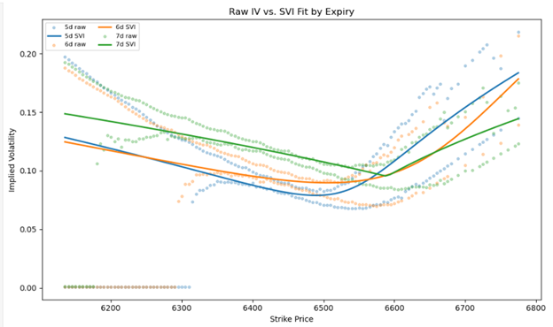

# SPX Volatility Surface (SVI) — Arbitrage Diagnostics
**TL;DR**: This repo fits SPX option surfaces with SVI, compares raw implied vols to smooth fits, and highlights short-dated wing dynamics for trading intuition.

  
*Raw SPX implied vols (dots) vs. SVI fits (lines) across short expiries.*


This repo fits an SPX volatility surface using **SVI (Stochastic Volatility Inspired)** and runs **no‑arbitrage checks** (calendar & butterfly) on real market data.

## What’s inside
- `notebooks/SPX_daily_sanitized.ipynb` — main notebook (loads secrets from `.env`)
- SVI fitting + smile/surface plots
- Calendar & butterfly arbitrage diagnostics

## Quickstart
1) Install:
```bash
pip install -r requirements.txt
```

2) Secrets: create a file named `.env` in the repo root with:
```
POLYGON_API_KEY=your_polygon_key_here
FRED_API_KEY=your_fred_key_here
```

3) Run:
- Open `notebooks/SPX_daily_sanitized.ipynb` and run all cells.
- The notebook uses `dotenv` + `find_dotenv()` to read `.env`.

## Notes
- For research/education only.
- SVI parameter inits/bounds affect stability; tweak if needed.
- Diagnostics report the worst violation to help clean/regularize.

## Case Study
[Open the PDF](./A%20CASE%20STUDY.pdf)
